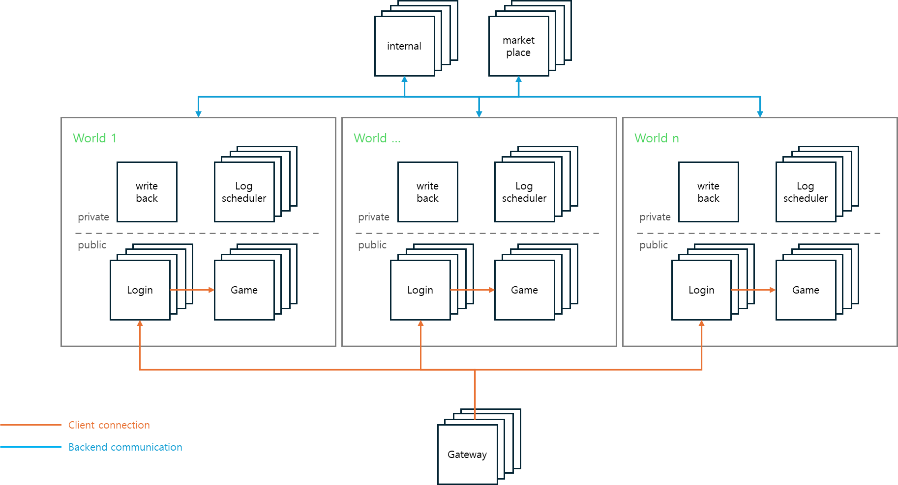
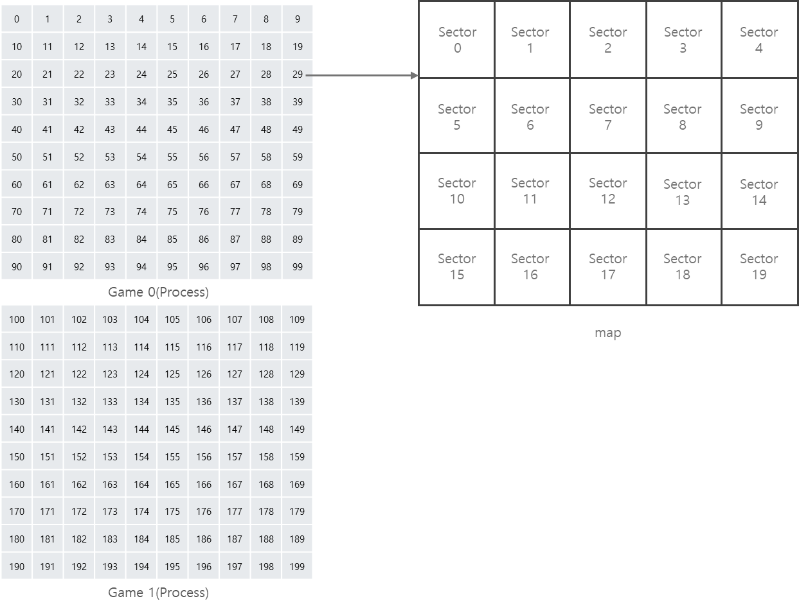
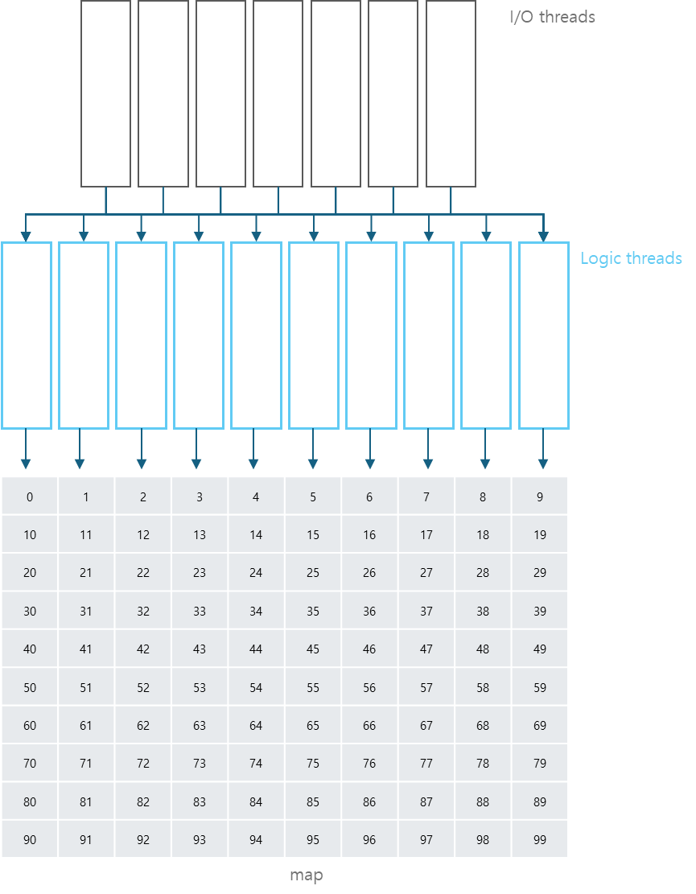

# fb

fb is a 2D MMORPG game server written in C++20.

## Features

- **High-performance**: Designed for scalability and real-time gameplay
- **Microservices Architecture**: Separate components for gateway, login, game, internal services, and write-back operations
- **Cross-platform**: Supports both Windows and Linux environments for development and production deployment
- **Comprehensive Testing**: Bot testing framework for load testing and integration testing
- **Lua Scripting**: Flexible game logic implementation through Lua scripts
- **Cloud Deployment**: Kubernetes deployment support with Pulumi infrastructure management

## Architecture



The server is organized around **worlds**: each world has its own data and services, while some services are shared across all worlds.

### Shared services (world-independent)
- **Gateway**: The single entry point for all clients. It checks client version, issues encryption keys, and provides a list of available worlds and their login servers. Clients connect to Gateway first, then to the chosen world's Login.
- **Internal**: Central service that all Gateway, Login, and Game instances communicate with. It handles database operations, synchronizes global resources (e.g., parties, clans), and broadcasts notifications via RabbitMQ.
- **Marketplace**: Shared service used by all worlds' Game servers for in-game marketplace operations.

### Per-world structure
Each world is organized into three layers:

**Infrastructure (infra)** — per world:
- **MySQL (Global)**: Global data for that world (accounts, configuration).
- **MySQL (Data)**: Sharded databases for game data (characters, items, etc.).
- **MySQL (Log)**: Sharded databases for logging (player actions, system events).
- **Redis**: Cache layer for hot data (global + data shards).

**Private** — per world:
- **Write-back**: Persists cached data from Redis to MySQL (Global/Data) for that world. One instance per world.
- **Log**: Consumes log messages from the shared RabbitMQ (Log) and writes them to that world's MySQL (Log).

**Public** — per world (clients connect to these after choosing a world):
- **Login**: Handles account-related tasks (character creation, password changes) and directs clients to a Game server in the same world. Communicates with Internal.
- **Game**: Game logic and sessions. Multiple processes (containers) per world. Communicates with Internal and Marketplace.

Shared infrastructure used by Internal, Marketplace, Log, etc. (not per-world) includes **Unified** MySQL, Redis, and **RabbitMQ** (Internal / Log).

## Map division



The game server divides each map into sectors. When an object's position changes, it may move to a different sector. For spatial queries, only nearby sectors are considered, reducing search costs.

## Thread Model



All game logic for objects on the same map runs on the same logic thread. The I/O thread receives data and posts packets to the appropriate logic thread's queue. The logic thread parses the packet and runs the handler. We assign the logic thread by map ID:

```cpp
thread_index = map.id % logic_thread_count
```

This ensures objects on the same map are always processed by the same thread, eliminating locks between nearby objects. However, uneven map distribution can overload a single thread, and communication between different maps becomes more complex. You can configure the counts of I/O and logic threads in the config file.

## Contact

- [YouTube](https://www.youtube.com/channel/UCPcH5qX7aLTFs3mgh32_FVQ?view_as=subscriber)
- [Blog](https://blog.naver.com/boyism)
