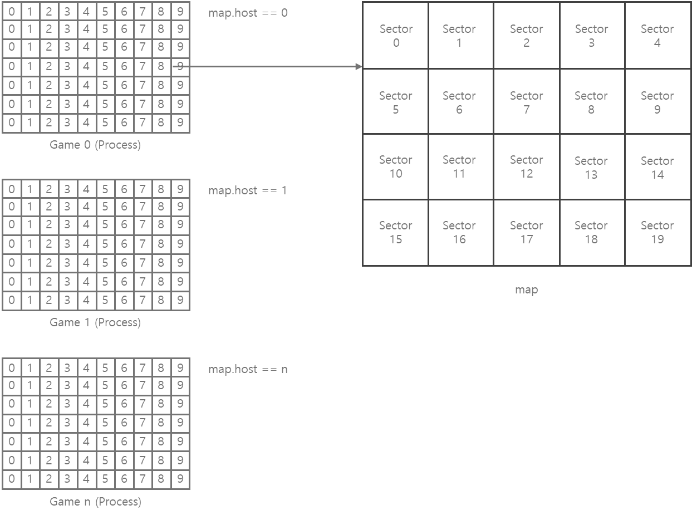

# fb

fb is a 2D MMORPG game server written in C++20.

## Installation

Follow the instructions for your target OS.

### Windows

1. **Prerequisites**  
   - Windows 10 or higher
   - Visual Studio 2022 must be installed.
   - MySQL 8.0 or higher
   - Redis 3.2.1 or
   - RabbitMQ 4.0.7 or higher
   - CMake 3.28 or higher

2. Run the `setup.bat` script in the project root.

3. After `setup.bat` completes, open `build/fb.sln` in Visual Studio 2022. Build the `lib` project first, then the remaining server projects.

4. If you need to change server settings later, edit `config/config.dev.json` or the `appsettings` files in the `internal` and `write-back` folders.

### Linux

1. **Prerequisites**  
   - Ubuntu 24.04.1 LTS or higher
   - Docker 26.1.3 or higher
   - Kubernetes 1.30.9 (kubectl) or higher
   - Pulumi 3.145.0 or higher

2. Run the setup script:
   ```sh
   ./shell.sh
   ```
3. If you need, edit `infra/pulumi/develop.json` to configure your cluster before deploying.

## Architecture


- **Gateway**: The first point of contact for clients. It checks client version, issues encryption keys, and provides a list of available login servers.
- **Login**: Handles account-related tasks like character creation and password changes, then directs clients to a game server. It communicates with other servers via the internal service.
- **Game**: Runs one process per zone rather than scaling out. It also uses the internal service to communicate with other game servers.
- **Internal**: Enables communication between the gateway, login, and game servers, and manages database operations. It synchronizes global resources (e.g., parties, clans) and uses RabbitMQ for messaging.
- **Write-back**: A standalone process that executes database queries generated by the internal server. It applies changes to MySQL instead of writing directly from the internal service, which first caches data in Redis.

## Map division



The game server divides each map into sectors. When an object's position changes, it may move to a different sector. For spatial queries, only nearby sectors are considered, reducing search costs.

## Thread Model


All game logic for objects on the same map runs on the same logic thread. The I/O thread receives data and posts packets to the appropriate logic thread's queue. The logic thread parses the packet and runs the handler. We assign the logic thread by map ID:

```cpp
thread_id = character.map.id % (logic_thread.length+1)
```

This ensures objects on the same map are always processed by the same thread, eliminating locks between nearby objects. However, uneven map distribution can overload a single thread, and communication between different maps becomes more complex. You can configure the counts of I/O, logic, and background threads in the config file.

## Contact

- [YouTube](https://www.youtube.com/channel/UCPcH5qX7aLTFs3mgh32_FVQ?view_as=subscriber)
- [Blog](https://blog.naver.com/boyism)
